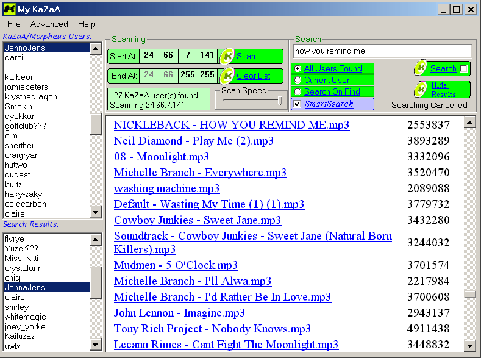



## Download from KaZaA users without connecting to KaZaA \(Update: Dec\. 12 \[7:30PM\]\)

### Description

This latest update [Dec.12 7:30PM] includes a better interface and a 'SmartSearch' option for much better search results. You can now search for a single ip or user too. I added menu's that allow you to save or open your lists (Nice feature after a long scan). Come check it out and vote if you like it and leave some feedback.
 
### More Info
 

             |
---                |---
**Submitted On**   |2001-12-12 19:29:26
**By**             |[James Gourley](https://github.com/Planet-Source-Code/PSCIndex/blob/master/ByAuthor/james-gourley.md)
**Level**          |Intermediate
**User Rating**    |5.0 (233 globes from 47 users)
**Compatibility**  |VB 6\.0
**Category**       |[Complete Applications](https://github.com/Planet-Source-Code/PSCIndex/blob/master/ByCategory/complete-applications__1-27.md)
**World**          |[Visual Basic](https://github.com/Planet-Source-Code/PSCIndex/blob/master/ByWorld/visual-basic.md)
**Archive File**   |[Download\_f4162012122001\.zip](https://github.com/Planet-Source-Code/james-gourley-download-from-kazaa-users-without-connecting-to-kazaa-update-dec-12-7-30pm__1-29585/archive/master.zip)

